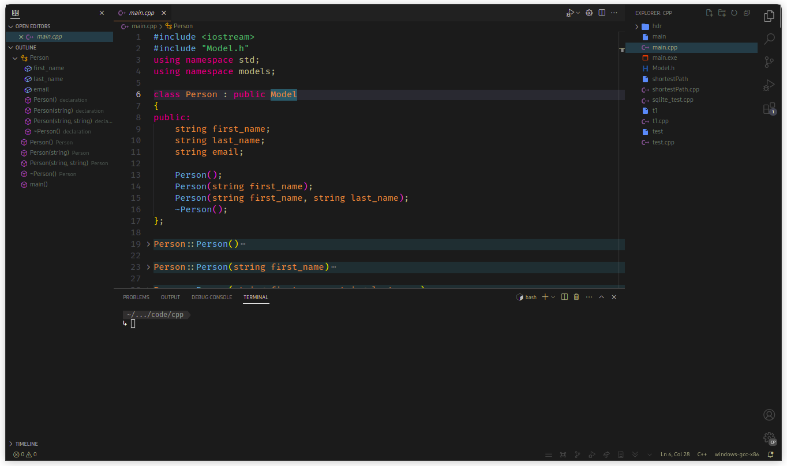
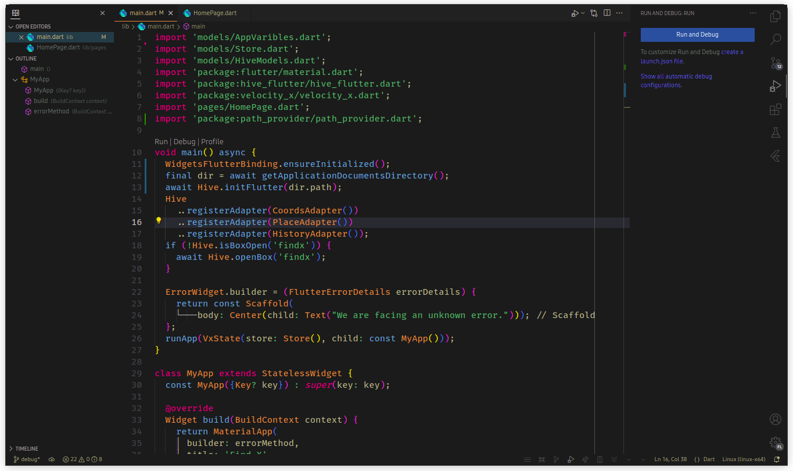
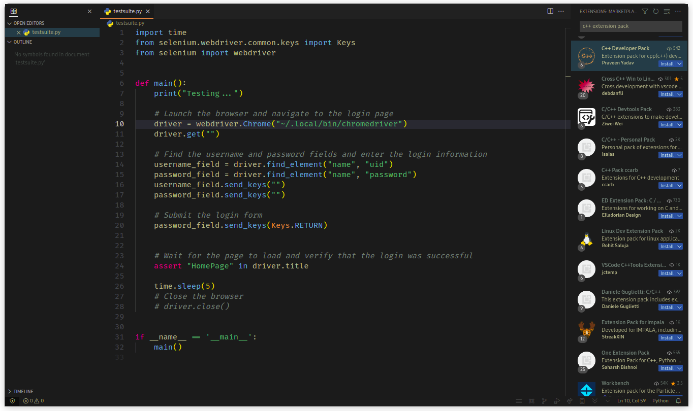

# Mili Theme

## Author: [Praveen Yadav](https://github.com/pixiedevpraveen)

Mili Theme is a sleek and modern theme for Visual Studio Code that combines bold and vibrant colors with a minimalist design. With Mili Theme, you can enjoy a clean and distraction-free coding environment that helps you stay focused and productive.

## Installation

To install Mili Theme, follow these steps:

1. Open Visual Studio Code
2. Click on the **Extensions** icon in the left-hand sidebar
3. Search for "Mili Theme"
4. Click **Install**
5. Click **Reload** to apply the theme

## Screenshots

Here are some screenshots of Mili Theme in action:

## Features

Mili Theme comes with a range of features to enhance your coding experience, including:

- A bold and modern color palette that is easy on the eyes
- Minimalist design that reduces visual clutter
- Customized syntax highlighting for popular programming languages
- Support for popular extensions like GitLens, Bracket Pair Colorizer, and more

## Feedback and Support

If you have any feedback or questions about Mili Theme, feel free to open an issue on the [GitHub repository](https://github.com/pixiedevpraveen/mili-theme/issues). We're always happy to hear from our users and are committed to providing the best possible experience with our themes.
